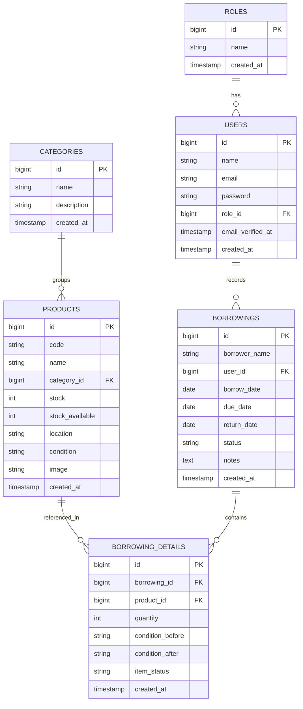

# Software Requirements Spesification (SRS)

## Web-Based Inventory Management System — PT Telkomsel

### Information Systems Internship Selection Challenge

---

**Version**: 1.0
**Purpose**: Development reference (can be used directly as context for Claude Code)
**Tech Stack**: Laravel 11+, PHP 8.x, MySQL/PostgreSQL, Tailwind CSS, Laravel Breeze

---

## Table of Contents

1. Executive Summary
2. Project Scope
3. Business Requirements Analysis
4. User Roles & Permissions
5. Database Design (ERD & Detailed Schema)
6. System Architecture
7. Functional Specifications per Module
8. REST API Specification
9. Non-Functional Requirements
10. Tech Stack & Packages
11. Project Folder Structure
12. Development Roadmap (7 Days)
13. Testing Strategy
14. Deployment Plan
15. Definition of Done / Acceptance Criteria
16. Appendix: Seed Data for Demo

---

## 1. Executive Summary

PT Telkomsel needs a system to replace manual inventory tracking that currently causes lost asset data, duplicate entries, difficulty monitoring stock levels, and slow report generation. The solution is a **web-based inventory management application built with Laravel**, featuring role-based access control, item master data management, a borrowing/return system, and a reporting dashboard.

**Problem → Solution mapping:**

| Business Problem            | Technical Solution                                                                     |
| --------------------------- | -------------------------------------------------------------------------------------- |
| Lost asset data             | Centralized database (MySQL/PostgreSQL) with backups and an audit trail via timestamps |
| Duplicate item records      | Unique item code (`unique constraint`) with application-level validation               |
| Difficulty monitoring stock | Real-time dashboard, available/borrowed status tracking                                |
| Slow report generation      | Automated dashboard + PDF/Excel export (bonus feature)                                 |

---

## 2. Project Scope

### In Scope

- Authentication (login, register, logout, forgot password)
- Role management (Admin, Staff, Manager)
- Item master data CRUD with categories
- Borrowing and return system (multi-item per transaction)
- Dashboard with statistics and charts
- Basic REST API (added value)

### Out of Scope (unless time permits as a stretch goal)

- Multi-tenant / multi-branch support
- Real-time email/SMS notifications
- Payment/billing
- Native mobile app

---

## 3. Business Requirements Analysis

### 3.1 System Actors

1. **Admin** — full system control (user management, all data)
2. **Staff** — warehouse officer, manages item data and daily borrowing transactions
3. **Manager** — stakeholder who needs report visibility without modifying data

### 3.2 Key Business Rules

- `BR-01`: Item code must be unique across the entire system.
- `BR-02`: An item cannot be borrowed if available stock = 0.
- `BR-03`: When an item is borrowed, available stock decreases; when returned, available stock increases.
- `BR-04`: A single borrowing transaction can include more than one type of item (header-detail relationship).
- `BR-05`: Borrowing status: `borrowed`, `returned`, `overdue` (automatically calculated if `due_date` has passed and the item has not been returned).
- `BR-06`: Only Admin and Staff can perform CRUD operations on item data; Manager has read-only access.
- `BR-07`: Only Admin can manage user accounts and roles.
- `BR-08`: Items with `heavily_damaged` condition cannot be borrowed.

---

## 4. User Roles & Permissions

| Feature / Module        |  Admin  |  Staff  |   Manager    |
| ----------------------- | :-----: | :-----: | :----------: |
| User & Role Management  | ✅ Full |   ❌    |      ❌      |
| Item Master Data (CRUD) | ✅ Full | ✅ Full | 👁️ View only |
| Item Categories (CRUD)  | ✅ Full | ✅ Full | 👁️ View only |
| Item Borrowing          | ✅ Full | ✅ Full | 👁️ View only |
| Item Return             | ✅ Full | ✅ Full |      ❌      |
| Dashboard & Reports     | ✅ Full | ✅ Full |   ✅ Full    |
| Export PDF/Excel        |   ✅    |   ✅    |      ✅      |

**Technical implementation**: Use Laravel **Policy** or **Gate** (`app/Policies/`) combined with role-check middleware — not just Blade-view validation — so API endpoints are also protected.

```php
// Example gate in AuthServiceProvider
Gate::define('manage-inventory', function (User $user) {
    return in_array($user->role->name, ['admin', 'staff']);
});
```

---

## 5. Database Design (ERD & Detailed Schema)

### 5.1 Entity Relationship Diagram



> **Key design note**: `borrowings` is the transaction header table (who borrowed, when), and `borrowing_details` is the line-item table (which items, how many). This allows **a single borrowing transaction to contain multiple items at once** — matching real-world needs and demonstrating stronger database design skill than a flat single-table approach.

### 5.2 Detailed Table Schema

#### `roles`

| Field                  | Type        | Constraint         | Description             |
| ---------------------- | ----------- | ------------------ | ----------------------- |
| id                     | bigint      | PK, auto increment |                         |
| name                   | varchar(50) | unique, not null   | admin / staff / manager |
| created_at, updated_at | timestamp   |                    |                         |

#### `users`

| Field                  | Type         | Constraint              | Description     |
| ---------------------- | ------------ | ----------------------- | --------------- |
| id                     | bigint       | PK                      |                 |
| name                   | varchar(100) | not null                |                 |
| email                  | varchar(100) | unique, not null        |                 |
| password               | varchar(255) | not null                | hashed (bcrypt) |
| role_id                | bigint       | FK → roles.id, not null |                 |
| email_verified_at      | timestamp    | nullable                |                 |
| remember_token         | varchar(100) | nullable                |                 |
| created_at, updated_at | timestamp    |                         |                 |

#### `categories`

| Field                  | Type         | Constraint | Description |
| ---------------------- | ------------ | ---------- | ----------- |
| id                     | bigint       | PK         |             |
| name                   | varchar(100) | not null   |             |
| description            | text         | nullable   |             |
| created_at, updated_at | timestamp    |            |             |

#### `products`

| Field                  | Type         | Constraint                               | Description                                                                        |
| ---------------------- | ------------ | ---------------------------------------- | ---------------------------------------------------------------------------------- |
| id                     | bigint       | PK                                       |                                                                                    |
| code                   | varchar(50)  | unique, not null                         | Item code                                                                          |
| name                   | varchar(150) | not null                                 |                                                                                    |
| category_id            | bigint       | FK → categories.id                       |                                                                                    |
| stock                  | int          | not null, default 0                      | Total physical stock                                                               |
| stock_available        | int          | not null, default 0                      | Stock currently available to borrow (stock - currently borrowed)                   |
| location               | varchar(100) | nullable                                 | Storage location                                                                   |
| condition              | enum         | good / lightly_damaged / heavily_damaged | Item condition                                                                     |
| image                  | varchar(255) | nullable                                 | Image path (bonus feature)                                                         |
| created_at, updated_at | timestamp    |                                          |                                                                                    |
| deleted_at             | timestamp    | nullable                                 | Soft delete (recommended, so borrowing history isn't broken if an item is deleted) |

#### `borrowings`

| Field                  | Type         | Constraint                    | Description                                  |
| ---------------------- | ------------ | ----------------------------- | -------------------------------------------- |
| id                     | bigint       | PK                            |                                              |
| borrower_name          | varchar(100) | not null                      | Name of the borrower                         |
| user_id                | bigint       | FK → users.id                 | Staff member who recorded the transaction    |
| borrow_date            | date         | not null                      |                                              |
| due_date               | date         | not null                      | Expected return date                         |
| return_date            | date         | nullable                      | Filled in once the item is actually returned |
| status                 | enum         | borrowed / returned / overdue |                                              |
| notes                  | text         | nullable                      |                                              |
| created_at, updated_at | timestamp    |                               |                                              |

#### `borrowing_details`

| Field                  | Type        | Constraint                            | Description                        |
| ---------------------- | ----------- | ------------------------------------- | ---------------------------------- |
| id                     | bigint      | PK                                    |                                    |
| borrowing_id           | bigint      | FK → borrowings.id, cascade on delete |                                    |
| product_id             | bigint      | FK → products.id                      |                                    |
| quantity               | int         | not null, default 1                   |                                    |
| condition_before       | varchar(50) | not null                              | Condition at the time of borrowing |
| condition_after        | varchar(50) | nullable                              | Condition at the time of return    |
| item_status            | enum        | borrowed / returned / lost / damaged  |                                    |
| created_at, updated_at | timestamp   |                                       |                                    |

### 5.3 Migration Order (important for foreign keys)

```
1. create_roles_table
2. create_users_table (with role_id FK)
3. create_categories_table
4. create_products_table (with category_id FK)
5. create_borrowings_table (with user_id FK)
6. create_borrowing_details_table (with borrowing_id, product_id FK)
```

---

## 6. System Architecture

**Architecture pattern**: Standard Laravel MVC + optional Repository pattern for complex queries.

```
Browser (Blade + Tailwind + optional Alpine.js)
        │
        ▼
   Routes (web.php / api.php)
        │
        ▼
  Middleware (auth, role-check)
        │
        ▼
   Controllers (thin — orchestration only)
        │
        ├──▶ Form Requests (validation)
        ├──▶ Services (complex business logic, e.g. borrowing process)
        └──▶ Models / Eloquent ORM
                │
                ▼
           MySQL / PostgreSQL
```

**Guiding principles:**

- Controllers should **not** contain complex direct database queries → move them to a Model scope or a Service class.
- Input validation always goes through a **Form Request** (`php artisan make:request`), not manual validation in the controller.
- Authorization goes through a **Policy**, not scattered manual `if` checks in views.

---

## 7. Functional Specifications per Module

### 7.1 Authentication Module

**User Stories:**

- As a user, I can register a new account so I can access the system.
- As a user, I can log in using my email & password.
- As a user, I can reset my password if I forget it.
- As a user, I can log out to end my session.

**Validation:**

- Email: valid format, unique in the users table.
- Password: minimum 8 characters, must contain letters & numbers.
- Default role on registration: `staff` (other roles can only be assigned by Admin, not via self-registration).

**Implementation**: Use **Laravel Breeze** (`php artisan breeze:install blade`) as the starting point, then customize it to add `role_id` to the registration flow.

---

### 7.2 Role Management Module

**User Stories:**

- As an Admin, I can view the list of users and change their role.
- As an Admin, I can deactivate a user account.

**Business Rules:**

- A role cannot be deleted if it is still assigned to any user (referential integrity).
- There must always be at least 1 active Admin account in the system at all times (to avoid locking the system out).

---

### 7.3 Item Master Data Module

**Required fields**: Item Code, Item Name, Category, Stock, Storage Location, Item Condition.

**User Stories & Features:**
| Feature | Description |
|---|---|
| Add Item | Form with unique code validation, category dropdown |
| Edit Item | Update data; code must remain unique among other items |
| Delete Item | Soft delete, confirmation modal before deleting |
| Item Detail | Detail page + borrowing history for that item |
| Item Search | Search by name/code, optional live search |
| Pagination | 10-15 items per page |

**Key validation:**

```php
'code' => 'required|string|max:50|unique:products,code,' . $productId,
'name' => 'required|string|max:150',
'category_id' => 'required|exists:categories,id',
'stock' => 'required|integer|min:0',
'condition' => 'required|in:good,lightly_damaged,heavily_damaged',
```

---

### 7.4 Item Borrowing Module

**Required fields**: Borrower Name, Item(s), Borrow Date, Return Date, Status.

**Business Flow (important — this is where many candidates get the design wrong):**

1. Staff/Admin creates a new borrowing transaction → selects borrower, borrow date, due date.
2. Add one or more items to the transaction (dynamic form — supports adding multiple rows).
3. System validates: `stock_available >= quantity` for each selected item.
4. Upon saving: each item's `stock_available` is decreased by its quantity, `borrowing.status = 'borrowed'`.
5. Upon return: select which items are being returned, record `condition_after`, `stock_available` is restored accordingly.
6. Once every item in the transaction has been returned → `borrowing.status = 'returned'`, `return_date` is filled automatically.
7. An (optional) scheduled job (via `php artisan schedule`) checks for transactions past their `due_date` that haven't been returned → updates status to `overdue`.

**Features:**

- Add Borrowing (multi-item)
- Item Return (per item, partial return supported)
- Borrowing History (filter by status, date, borrower)
- Item Status (visual badge: borrowed/returned/overdue)

---

### 7.5 Dashboard Module

**Widgets displayed:**
| Widget | Data Source |
|---|---|
| Total Items | `COUNT(products)` |
| Items Borrowed | `SUM(borrowing_details.quantity) WHERE item_status = 'borrowed'` |
| Items Available | `SUM(products.stock_available)` |
| Monthly Borrowing Chart | `GROUP BY MONTH(borrow_date)` — using Chart.js |

**Example query for the chart:**

```php
Borrowing::selectRaw('MONTH(borrow_date) as month, COUNT(*) as total')
    ->whereYear('borrow_date', now()->year)
    ->groupBy('month')
    ->orderBy('month')
    ->get();
```

---

## 8. REST API Specification

Base URL: `/api/v1`. Authentication via **Laravel Sanctum** (token-based, suitable for future SPA/mobile use).

| Method | Endpoint                  | Description                                    | Role          |
| ------ | ------------------------- | ---------------------------------------------- | ------------- |
| POST   | `/auth/login`             | Login, returns token                           | Public        |
| POST   | `/auth/logout`            | Revoke token                                   | Authenticated |
| GET    | `/products`               | List items (paginated, filterable, searchable) | All           |
| POST   | `/products`               | Add item                                       | Admin, Staff  |
| GET    | `/products/{id}`          | Item detail                                    | All           |
| PUT    | `/products/{id}`          | Update item                                    | Admin, Staff  |
| DELETE | `/products/{id}`          | Delete item (soft delete)                      | Admin, Staff  |
| GET    | `/categories`             | List categories                                | All           |
| POST   | `/categories`             | Add category                                   | Admin, Staff  |
| GET    | `/borrowings`             | List borrowings (filter by status)             | All           |
| POST   | `/borrowings`             | Create new borrowing transaction               | Admin, Staff  |
| GET    | `/borrowings/{id}`        | Transaction detail + items                     | All           |
| PATCH  | `/borrowings/{id}/return` | Process return                                 | Admin, Staff  |
| GET    | `/dashboard/summary`      | Dashboard statistics                           | All           |
| GET    | `/dashboard/chart`        | Borrowing chart data                           | All           |

**Example response format (consistent across all endpoints):**

```json
{
  "success": true,
  "message": "Data retrieved successfully",
  "data": {},
  "meta": {
    "current_page": 1,
    "total": 50
  }
}
```

**Example request body — create a new borrowing:**

```json
{
  "borrower_name": "Budi Santoso",
  "borrow_date": "2026-07-02",
  "due_date": "2026-07-09",
  "items": [
    { "product_id": 3, "quantity": 2 },
    { "product_id": 7, "quantity": 1 }
  ]
}
```

---

## 9. Non-Functional Requirements

| Category        | Requirement                                                                                                             |
| --------------- | ----------------------------------------------------------------------------------------------------------------------- |
| Performance     | Paginated list pages must load in < 2 seconds for ≤1000 records                                                         |
| Security        | Passwords hashed (bcrypt), CSRF protection enabled, SQL injection prevented via Eloquent/query builder (no raw queries) |
| Usability       | Responsive on mobile & desktop (Tailwind breakpoints)                                                                   |
| Reliability     | Server-side validation required even when client-side validation exists                                                 |
| Maintainability | Code follows PSR-12, use Laravel Pint for auto-formatting                                                               |
| Auditability    | Every table has `created_at`/`updated_at`; consider `created_by` for an audit trail                                     |

---

## 10. Tech Stack & Packages

| Need                                                        | Package/Tool                                             |
| ----------------------------------------------------------- | -------------------------------------------------------- |
| Framework                                                   | Laravel 11+                                              |
| Auth scaffolding                                            | Laravel Breeze (Blade stack)                             |
| API Auth                                                    | Laravel Sanctum                                          |
| Styling                                                     | Tailwind CSS                                             |
| Charts                                                      | Chart.js (via CDN or npm)                                |
| PDF Export                                                  | `barryvdh/laravel-dompdf`                                |
| Excel Export                                                | `maatwebsite/excel`                                      |
| Testing                                                     | PHPUnit / Pest (built into Laravel)                      |
| Permissions (optional, more robust than manual role checks) | `spatie/laravel-permission`                              |
| Image upload                                                | Laravel Storage (local disk, `php artisan storage:link`) |

---

## 11. Project Folder Structure

```
app/
├── Http/
│   ├── Controllers/
│   │   ├── Auth/                  (from Breeze)
│   │   ├── ProductController.php
│   │   ├── CategoryController.php
│   │   ├── BorrowingController.php
│   │   ├── DashboardController.php
│   │   └── Api/
│   │       ├── ProductApiController.php
│   │       └── BorrowingApiController.php
│   ├── Requests/
│   │   ├── StoreProductRequest.php
│   │   ├── UpdateProductRequest.php
│   │   └── StoreBorrowingRequest.php
│   └── Middleware/
│       └── CheckRole.php
├── Models/
│   ├── User.php
│   ├── Role.php
│   ├── Category.php
│   ├── Product.php
│   ├── Borrowing.php
│   └── BorrowingDetail.php
├── Policies/
│   ├── ProductPolicy.php
│   └── BorrowingPolicy.php
└── Services/
    └── BorrowingService.php       (borrowing/return business logic)

database/
├── migrations/
├── seeders/
│   ├── RoleSeeder.php
│   ├── UserSeeder.php
│   └── ProductSeeder.php
└── factories/

resources/
└── views/
    ├── layouts/
    ├── products/
    ├── borrowings/
    └── dashboard/
```

---

## 12. Development Roadmap (7 Days)

| Day | Focus                                                    | Output                                        |
| --- | -------------------------------------------------------- | --------------------------------------------- |
| 1   | Project setup, migrations, seeders, auth (Breeze)        | Login/register working, DB structure in place |
| 2   | Role management, middleware, policies                    | Role-based access functioning                 |
| 3   | Item Master Data CRUD + categories                       | Complete item management feature              |
| 4   | Borrowing & Return module                                | Borrow/return transactions working            |
| 5   | Dashboard + charts + Tailwind styling                    | Dashboard displaying real data                |
| 6   | REST API, testing, bonus features (export, image upload) | API + bonus features complete                 |
| 7   | Deployment, README, documentation, presentation practice | Live demo ready                               |

---

## 13. Testing Strategy

**Minimum required unit tests (for the "Unit Testing" bonus points):**

```
tests/Feature/
├── AuthTest.php              → test login, register, logout success/failure
├── ProductTest.php           → test item CRUD, unique code validation
├── BorrowingTest.php         → test that borrowing decreases stock_available
│                                test that returning increases stock_available
│                                test that borrowing is blocked when stock = 0
└── RoleAccessTest.php        → test Manager cannot access create/edit
```

**Example key test case:**

```php
public function test_cannot_borrow_when_stock_unavailable()
{
    $product = Product::factory()->create(['stock_available' => 0]);
    $response = $this->actingAs($staffUser)->post('/borrowings', [
        'items' => [['product_id' => $product->id, 'quantity' => 1]],
    ]);
    $response->assertSessionHasErrors();
}
```

---

## 14. Deployment Plan

**Free options for a demo:**

1. **Railway** or **Render** → deploy Laravel + PostgreSQL for free
2. **Vercel** does not natively support Laravel PHP — avoid unless using a serverless adapter
3. Alternatives: **Hostinger free trial**, or a cheap VPS (scores extra points)

**Checklist before deploying:**

- [ ] `.env.example` is complete and accurate
- [ ] `php artisan config:cache` & `route:cache` have been run
- [ ] Migrations + seeders can run fresh on the server (`php artisan migrate --seed`)
- [ ] Storage link set up for image uploads (`php artisan storage:link`)
- [ ] `APP_DEBUG=false` in production

---

## 15. Definition of Done / Acceptance Criteria

A feature is considered **done** when:

- [ ] It works according to the business rules in this document
- [ ] Server-side input validation is complete (not just HTML5 `required`)
- [ ] Role/permission checks are enforced (not accessible to unauthorized roles, including via API)
- [ ] No raw SQL queries vulnerable to injection
- [ ] Responsive on mobile screens
- [ ] Committed to GitHub with a clear commit message

---

## 16. Appendix: Seed Data for Demo

**Test accounts (must be listed in the README):**

| Role    | Email                   | Password    |
| ------- | ----------------------- | ----------- |
| Admin   | admin@inventaris.test   | password123 |
| Staff   | staff@inventaris.test   | password123 |
| Manager | manager@inventaris.test | password123 |

**Example RoleSeeder.php:**

```php
public function run(): void
{
    Role::insert([
        ['name' => 'admin', 'created_at' => now(), 'updated_at' => now()],
        ['name' => 'staff', 'created_at' => now(), 'updated_at' => now()],
        ['name' => 'manager', 'created_at' => now(), 'updated_at' => now()],
    ]);
}
```

**Example ProductSeeder.php (use factories for realistic dummy data):**

```php
public function run(): void
{
    Category::factory(5)->create();
    Product::factory(30)->create();
}
```

---

## Note on Terminology (ID ↔ EN)

Since the original challenge brief was in Indonesian, here's a quick mapping in case you cross-reference the Indonesian version of this document or the challenge PDF:

| Indonesian                          | English                                  |
| ----------------------------------- | ---------------------------------------- |
| Peminjaman                          | Borrowing                                |
| Pengembalian                        | Return                                   |
| Barang                              | Item / Product                           |
| Peminjam                            | Borrower                                 |
| Stok                                | Stock                                    |
| Kondisi Barang                      | Item Condition                           |
| baik / rusak ringan / rusak berat   | good / lightly damaged / heavily damaged |
| dipinjam / dikembalikan / terlambat | borrowed / returned / overdue            |
